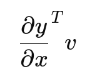
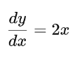

# LibTorch explorations in tensors and autograd

This is program demonstrates the use of **LibTorch** (the C++ API for PyTorch).

* Building tensors that require gradients
* Performing autograd computations
* Inspecting computation graphs (`grad_fn`)
* Calling `.backward()`
* Doing a vector–Jacobian product

## 1. Create a tensor with gradients enabled

```cpp
auto x = torch::ones({2, 2}, torch::requires_grad());
std::cout << x << std::endl;
```

* `x` is a 2×2 tensor of ones.
* `requires_grad=true` tells autograd to track operations involving `x`.


## 2. Build computation graph

```cpp
auto y = x + 2;
std::cout << y << std::endl;
std::cout << y.grad_fn()->name() << std::endl;
```

* `y` is computed as `x + 2`.
* Because `2` is a constant and `x` requires grad, PyTorch creates a `grad_fn` node.
* `y.grad_fn()->name()` prints the operation (often `"AddBackward"` or similar).


## **3. More operations → deeper graph**

```cpp
auto z = y * y * 3;
auto out = z.mean();
```

* `z = y * y * 3` squares each element and multiplies by 3.
* `out` is a scalar: the mean of all elements of `z`.
* Printing `grad_fn` shows the chain of backward ops.


## **4. Requires-grad flag demonstration**

```cpp
auto a = torch::randn({2, 2});
a = ((a * 3) / (a - 1));
std::cout << a.requires_grad() << std::endl;  // false
```

* `a` is created **without** requiring grad.
* All the following operations still produce tensors with `requires_grad=false` because the original `a` does not require grad.

Then:

```cpp
a.requires_grad_(true);
std::cout << a.requires_grad() << std::endl;  // now true
```

* `.requires_grad_(true)` modifies the tensor **in-place** to track gradients.

Now:

```cpp
auto b = (a * a).sum();
std::cout << b.grad_fn()->name() << std::endl;
```

* Since `a` now requires grad, `b` gets a grad_fn such as `"SumBackward"` or `"MulBackward"`.


## 5. Backward pass on `out`

```cpp
out.backward();
```

Computes `d(out)/dx` and stores the result in `x.grad()`.


## 6. Vector–Jacobian product (VJP)

This part is very important for understanding autograd internals.

```cpp
x = torch::tensor({1.0, 2.0, 3.0}, torch::requires_grad());
y = x * x;  // y = [1, 4, 9]
auto v = torch::tensor({0.1, 1.0, 0.0001});
y.retain_grad();
y.backward(v);
```

* `y = x²` elementwise.
* `.backward(v)` computes



* For `y = x²`,



So:

```
x = [1, 2, 3]
2x = [2, 4, 6]
```

Apply vector–Jacobian product:

```
v = [0.1, 1.0, 0.0001]

grad = v * (2x)
      = [0.1*2, 1*4, 0.0001*6]
      = [0.2, 4, 0.0006]
```

Which appears in:

```cpp
x.grad()
```

### Why `y.retain_grad()`?

* Non-leaf tensors (like `y`) normally do **not** keep `.grad()` after backward.
* `retain_grad()` forces autograd to store it.

### 7. Final prints

```cpp
std::cout << "x.grad() = " << x.grad() << std::endl;
std::cout << "y.grad() = " << y.grad() << std::endl;
```

* `x.grad()` contains the VJP result.
* `y.grad()` contains the vector `v`.
